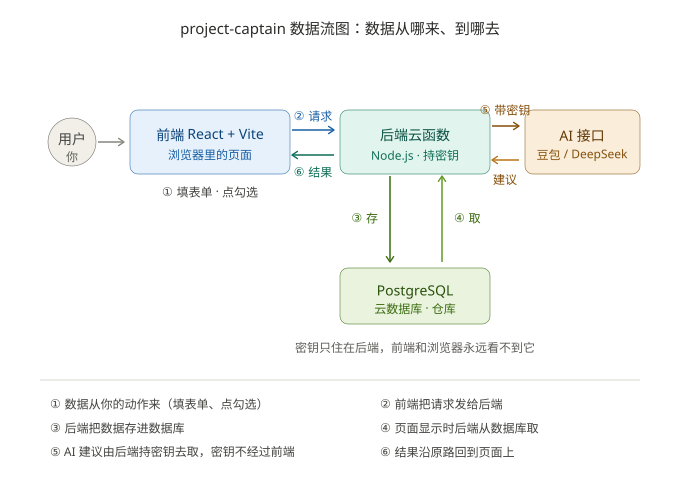

# TECH_DESIGN.md — project-captain（我是超强负责人）技术设计

> 版本：v1.0（2026-09-27）· 对应 PRD v1.0.2 · Day 5 产出
> 一句话数据流：**数据从你在页面上填的表单和点的勾选框来，经后端检查后存进云数据库；页面显示时再由后端从数据库读出来送回前端；AI 建议的数据从豆包/DeepSeek 来，由后端拿着密钥去取（密钥不经过前端）。**

---

## 一、技术路线：三套方案比较与选择

| | 方案 A：课程示范路线 ⭐选定 | 方案 B：纯前端 + 浏览器存储 | 方案 C：自建服务器路线 |
|---|---|---|---|
| 前端 | React + Vite | React + Vite | React + Vite |
| 后端 | CloudBase Node.js 云函数 | 无 | Express + 自租服务器 |
| 数据库 | CloudBase PostgreSQL | localStorage（只存本机） | SQLite/MySQL 自管 |
| 部署 | CloudBase 静态网站托管 | 免费静态托管 | 全套自己配 |
| 优点 | 一体化部署最省心；课程有示范可对照；AI 密钥能安全放在后端 | 最简单，两天能跑通 | 自由度最大 |
| 缺点 | 绑定腾讯云生态；云函数冷启动有几秒延迟 | **密钥藏不住，AI 功能做不了**；换电脑/清缓存数据全丢 | 服务器运维超出零基础 28 天能力 |

**为什么选 A（取舍说明）**：方案 B 的致命伤是 AI 密钥只能放进前端代码——任何人打开浏览器开发者工具就能偷走，违反本项目「密钥不进代码」的铁律，所以纯前端路线直接出局。方案 C 要自己管服务器、证书、防火墙，28 天里光是运维就能吃掉全部开发时间。**方案 A 用一点「被平台绑定」的自由，换来「零基础 28 天能活着交付」的确定性**；且 PRD 功能 7（AI 每日建议）必须有后端持密钥调用才成立。AI 接口层做成可切换的适配层，豆包与 DeepSeek 二选一或都接（见第七节）。

---

## 二、项目结构

```
project-captain/
├── research.md            Day 3 产出
├── PRD.md                 Day 4 产出
├── TECH_DESIGN.md         Day 5 产出（本文档）
├── dataflow.svg           Day 5 产出（数据流图）
├── web/                   前端（React + Vite，部署到 CloudBase 静态托管）
│   └── src/
│       ├── pages/
│       │   ├── HomePage.jsx        项目栏：列出所有项目 + 新建入口
│       │   └── ProjectPage.jsx     项目详情：每日待办 / 勾选 / 进度 / AI 建议
│       └── api.js                  封装所有对后端的请求（全项目唯一出口）
└── server/                后端（CloudBase Node.js 云函数）
    └── functions/
        ├── projects.js    项目相关接口
        ├── todos.js       待办相关接口
        └── ai.js          AI 每日建议接口（密钥只在这里出现）
```

规则：前端**只**通过 `api.js` 和后端说话；后端**只**在 `ai.js` 里接触 AI 密钥。改哪层不影响另一层。

---

## 三、数据模型（PostgreSQL 两张表起步）

**表 1：projects（项目）**

| 字段 | 类型 | 说明 |
|---|---|---|
| id | UUID 主键 | 项目编号，自动生成 |
| name | 文本 | 项目名（如「毕业设计」） |
| description | 文本 | 项目定位一句话 |
| start_date | 日期 | 开始日期 |
| due_date | 日期 | 结束日期（进度条按它算） |
| milestones | JSONB | 关键节点列表（名称+日期） |
| owner_key | 文本 | **预留**：使用者的轻标识（v1 无登录时先存「默认用户」，v2.0 加登录后接真实身份） |
| created_at | 时间戳 | 创建时间 |

**表 2：todos（每日待办）**

| 字段 | 类型 | 说明 |
|---|---|---|
| id | UUID 主键 | 待办编号 |
| project_id | UUID 外键 | 属于哪个项目 |
| day | 日期 | 这是「哪一天」的待办（按天分组靠它） |
| content | 文本 | 待办内容 |
| is_done | 布尔 | 完成没有 |
| done_at | 时间戳 | 什么时候勾的 |
| note | 文本 | 当天工作汇报一句话（PRD 功能 4） |
| sort_order | 整数 | 同一天内的显示顺序 |

**非单机单机的处理**：v1 没有登录系统，`owner_key` 统一填「default」，行为上等于单人；但表结构里身份字段已预留，v2.0 上登录时不迁移数据、不清数据，直接开始按 `owner_key` 过滤即可。

---

## 四、API 列表（后端云函数对外提供的能力）

| # | 接口 | 方法 | 干什么 | 对应 PRD 功能 |
|---|---|---|---|---|
| 1 | `/api/projects` | GET | 列出所有项目（项目栏） | 功能 1 |
| 2 | `/api/projects` | POST | 新建项目（表单提交） | 功能 2 |
| 3 | `/api/projects/:id` | GET | 取单个项目详情（含按天分组的待办） | 功能 3 |
| 4 | `/api/projects/:id` | PATCH | 改项目信息（名称/日期/节点） | 功能 3 |
| 5 | `/api/projects/:id/todos` | POST | 给某天加一条待办 | 功能 4 |
| 6 | `/api/todos/:id` | PATCH | 勾选/取消待办、改内容、写汇报 | 功能 4、5 |
| 7 | `/api/projects/:id/progress` | GET | 算完成进度（已完/总数） | 功能 6 |
| 8 | `/api/ai/daily-suggestion` | POST | 调 AI 生成「明天做什么」建议 | 功能 7 |
| 9 | `/api/health` | GET | 健康检查（部署后第一件事就是戳它） | — |

约定：请求和响应都用 JSON；出错统一返回 `{ "error": "给用户看的中文说明" }`。

---

## 五、前后端数据流



**保存待办（写路径）**：用户在项目页勾选待办 → 前端先把界面变灰（乐观更新，感觉快）→ `api.js` 发 `PATCH /api/todos/:id` → 云函数校验参数 → 写入 PostgreSQL → 成功则返回新状态；失败则前端把勾选**回滚**并提示。

**打开页面（读路径）**：用户进项目栏 → `GET /api/projects` → 云函数查库 → 返回项目列表 → 渲染卡片；点进项目再 `GET /api/projects/:id` 拿待办和进度。

**AI 建议（功能 7）**：用户点「让 AI 帮我想想明天做什么」→ 前端把项目名、最近待办发给 `/api/ai/daily-suggestion` → 云函数从**环境变量**取密钥 → 调豆包/DeepSeek → 把建议文本返回前端展示 → 用户点「采纳」走上面的写路径变成真待办。

---

## 六、错误处理（7 种情况，每种都有交代）

| 情况 | 用户看到什么 | 系统怎么处理 |
|---|---|---|
| 网络断了/请求失败 | 「保存失败，正在重试…」+ 重试按钮 | 前端自动重试 1 次，再失败回滚勾选 |
| 后端挂了/云函数报错 | 「服务开小差了，请稍后再试」 | 错误写日志，不暴露技术细节给用户 |
| AI 超时或调用失败 | 「AI 这次没想出来，稍后再试」 | 15 秒超时；**绝不连累其他功能**（PRD 第 14 条） |
| 表单没填完就提交 | 对应输入框红框 + 提示「项目名要填哦」 | 前端先校验，后端再校验一遍（不信任前端） |
| 数据库写入失败 | 同网络失败处理 | 记录失败日志，数据不落库不出成功提示 |
| 打开不存在的项目 | 「找不到这个项目」+ 返回项目栏按钮 | 后端返回 404，前端跳转 |
| 重复快速点击 | 界面防抖，只发一次请求 | 前端按钮点击后短暂禁用 |

---

## 七、环境变量（密钥的家，绝不进代码、绝不进提交）

| 变量名 | 放什么 | 谁用 |
|---|---|---|
| `DATABASE_URL` | PostgreSQL 连接串 | 云函数连库 |
| `AI_PROVIDER` | `doubao` 或 `deepseek`（切哪家就改它） | ai.js 适配层 |
| `DOUBAO_API_KEY` | 豆包（火山方舟）密钥 | ai.js |
| `DEEPSEEK_API_KEY` | DeepSeek 密钥 | ai.js |
| `NODE_ENV` | `dev` / `prod` | 全部 |

存放方式：本地开发放 `.env` 文件（**已在 .gitignore 里，永不提交**）；线上配在 CloudBase 云函数的环境变量设置里。切换豆包↔DeepSeek 只改 `AI_PROVIDER` 一个字。

---

## 八、迁移与后续注意事项

1. **localStorage → PostgreSQL**：不排除开发第一周先用 localStorage 快速做界面原型；转正时字段按本文档第三节对齐，写一个一次性导入脚本，导完即弃
2. **豆包 ↔ DeepSeek 切换**：适配层只认「输入项目信息 → 输出建议文本」这一个契约，两家返回格式差异都挡在 `ai.js` 里，换供应商前端零改动
3. **单人 → 多用户（v2.0）**：`owner_key` 已预留；到时加登录表，把 default 数据批量归属给注册者即可，无需改表结构
4. **CloudBase 计费**：注册后先确认免费额度覆盖「静态托管 + 云函数调用数 + PostgreSQL 最小规格」；不够再议降级（如函数改用免费层额度策略）
5. **PRD 同步点**：PRD v1.0.2 写的「MVP 单机单人」按你今天的决定放宽为「无登录的轻多人预留」，改动仅一句话，列入下次推送（v1.0.3）

---

> 变更记录：v1.0（2026-09-27）Day 5 产出。技术路线选定方案 A（React/Vite + CloudBase 云函数 + CloudBase PostgreSQL + 静态托管）；AI 适配层支持豆包/DeepSeek 二选一；数据模型两张表 + owner_key 预留多用户。
